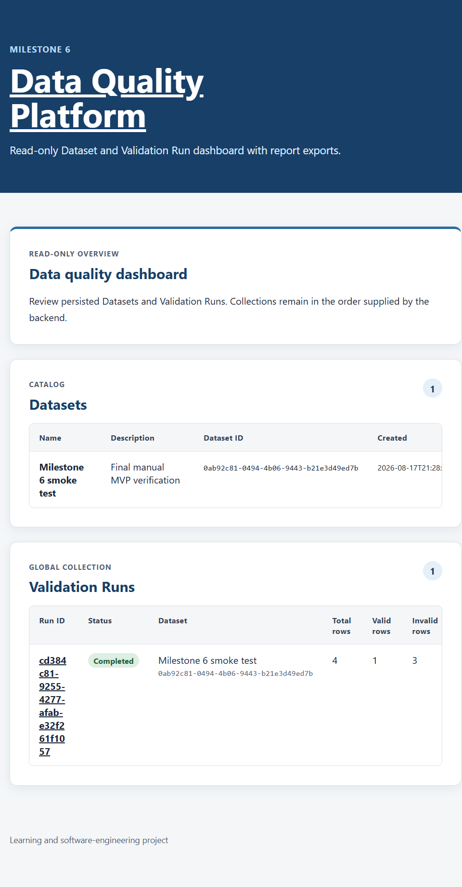
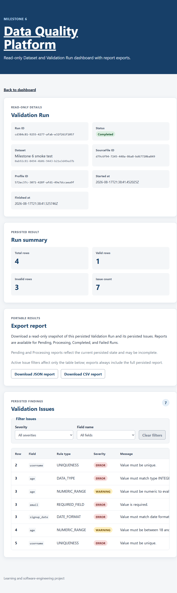

# Data Quality Platform

The Data Quality Platform is a local full-stack application for configuring reusable validation rules, validating uploaded CSV data, and reviewing persisted results. It combines a Spring Boot modular monolith with a read-only React dashboard, on-demand JSON and CSV reports, and operational diagnostics.

The planned local MVP and all six milestones are complete. The project is intentionally scoped as learning and reference software for local use; it is not production-ready.

## Highlights

- Configurable Datasets, Validation Profiles, and five deterministic Validation Rule types.
- Exact-byte CSV storage with SHA-256 checksums and strict UTF-8 parsing.
- Persisted Validation Run lifecycle, summary counters, failure states, and ordered Issues.
- Accessible Dashboard and addressable Run detail views with client-side Issue filtering.
- Faithful JSON and CSV report exports that preserve stored values and Issue order.
- Structured JSON logs, health checks, built-in runtime metrics, and bounded domain metrics.
- PostgreSQL Testcontainers integration tests and backend, frontend, and Compose checks in GitHub Actions.

## Problem

CSV quality checks are often scattered across scripts and manual review. This project gives validation configuration, input provenance, deterministic execution, persisted findings, and report export one explicit workflow whose outcomes can be inspected and reproduced.

## What This Project Covers

1. Create a Dataset, a Validation Profile, and reusable Validation Rules through the REST API.
2. Upload a CSV file while preserving its exact bytes, metadata, and SHA-256 checksum.
3. Create a synchronous Validation Run that parses the stored file and evaluates enabled Rules.
4. Persist the Run lifecycle, summary counters, ordered Issues, and safe failure outcomes.
5. Review Datasets, Runs, summaries, and Issues in a read-only browser interface.
6. Export the complete persisted Run snapshot as JSON or CSV and inspect local logs and metrics.

The scope is deliberately bounded. The MVP does not include authentication, update or delete operations, pagination, background processing, production deployment, or automated data repair.

## Features

### Backend and Data

- REST endpoints for Dataset, Validation Profile, Validation Rule, SourceFile upload, Validation Run, Issue retrieval, and report export workflows.
- PostgreSQL persistence managed exclusively through Flyway migrations V1 through V9; Hibernate validates mappings but does not generate schema changes.
- Rule-specific `jsonb` parameter constraints and application-level semantic validation.
- Synchronous CSV parsing and deterministic validation with atomic persistence of successful summaries and Issues.
- Explicit `PENDING`, `PROCESSING`, `COMPLETED`, and `FAILED` Run states, including safe parser failures and recovered validation-processing failures.

### Frontend

- `/` Dashboard for persisted Datasets and the global Validation Run collection.
- Addressable `/runs/:runId` detail route with metadata, persisted summaries, Issues, and report downloads.
- Exact client-side severity and field-name filters with AND semantics and preserved backend order.
- Accessible loading, error, Retry, empty, and empty-filter-result states, plus keyboard-usable tables and controls.
- Dataset-name resolution with UUID fallback; SourceFile and Validation Profile references remain UUID-only.

### Reporting and Operations

- Read-only JSON and CSV reports generated from one repeatable-read persisted snapshot.
- Managed browser downloads that remain independent from active Issue filters.
- Logstash-compatible structured application logs with a small, stable event vocabulary.
- Actuator health and metrics endpoints with low-cardinality validation and report meters.

### Quality and Verification

- Unit, repository, API integration, accessibility-oriented frontend, and report-contract tests.
- Real PostgreSQL integration tests through Testcontainers.
- Spotless, ESLint, Prettier, TypeScript, Vite build, and Docker Compose validation checks.
- GitHub Actions jobs for backend verification, frontend checks, and Compose validation.

## Architecture

The project is a modular monolith. The React and TypeScript browser application uses relative `/api` requests; Vite proxies those requests to the Spring Boot backend during local development. The backend is one deployable application whose packages separate responsibilities without exposing JPA entities or repositories across module boundaries:

- `dataset` owns Datasets, Validation Profiles, Validation Rules, and their public read boundaries.
- `ingestion` owns SourceFiles, CSV parsing, Validation Runs, and Run lifecycle persistence.
- `validation` owns deterministic Rule execution and persisted Validation Issues.
- `reporting` reads immutable Run and Issue views and renders on-demand JSON and CSV snapshots. It never recalculates summaries or changes processing state.
- `operations` owns bounded application metrics; Spring Boot Actuator provides health and runtime diagnostics, and application events are written as structured JSON.

PostgreSQL is the system of record. Flyway alone manages its schema, while Hibernate validates mappings at startup. Docker Compose intentionally provides PostgreSQL only; the backend and Vite development server run as local processes. No message broker, background worker, or monitoring stack is part of the MVP.

## Why This Project Matters

The implementation emphasizes clear module ownership, deterministic ordering, consistent transactional outcomes, accessible asynchronous UI states, and verification across backend, frontend, database, and CI layers. Those choices make both successful and failed validation outcomes explainable without expanding the project beyond its local MVP scope.

## Tech Stack

| Area | Technologies |
| --- | --- |
| Backend | Java 21, Spring Boot 4.1, Spring MVC, Spring Data JPA, Hibernate, Bean Validation |
| Persistence | PostgreSQL 18, Flyway, PostgreSQL `jsonb` constraints |
| CSV and reporting | Apache Commons CSV, SHA-256 checksums, JSON and RFC 4180 CSV exports |
| Frontend | React 19, TypeScript 6, React Router 7, Vite 8 |
| Operations | Spring Boot Actuator, Micrometer, Logstash-compatible structured logging |
| Testing | JUnit, Mockito, MockMvc, Testcontainers, Vitest, Testing Library |
| Tooling | Maven Wrapper, npm, Docker Compose, Spotless, ESLint, Prettier, GitHub Actions |

## Demo Screenshots





## Repository Layout

```text
backend/                 Spring Boot application, persistence, REST APIs, validation, reporting, operations, and Maven Wrapper
frontend/                React, TypeScript, and Vite application
assets/                  README screenshots
.github/workflows/       Continuous integration checks
compose.yaml             Local PostgreSQL service
.env.example             Example local database and datasource configuration
PROJECT_BRIEF.md         Product scope and milestone definition
```

## Setup

### Prerequisites

- Java Development Kit 21
- Node.js 24 LTS and npm 11
- Docker with Docker Compose, required for the local database and backend integration tests

Maven does not need to be installed globally because the backend includes the Maven Wrapper.

### Configure the Environment

Create an untracked local environment file and replace the example password before starting PostgreSQL.

Unix-like shells:

```sh
cp .env.example .env
```

Windows PowerShell:

```powershell
Copy-Item .env.example .env
```

The available variables are:

- `POSTGRES_HOST`: backend database host, defaults to `localhost`
- `POSTGRES_DB`: database name, defaults to `data_quality`
- `POSTGRES_USER`: database user, defaults to `data_quality`
- `POSTGRES_PASSWORD`: required local password
- `POSTGRES_PORT`: host port, defaults to `5432`
- `SOURCE_FILE_MAX_SIZE`: maximum uploaded file size, defaults to `10MB`
- `SOURCE_FILE_MAX_REQUEST_SIZE`: multipart request limit, defaults to `11MB`

The PostgreSQL port is bound to `127.0.0.1` and is not exposed on external network interfaces.

Docker Compose reads `.env` automatically. Spring Boot does not, so load the same variables into the backend process environment before starting it. Spring Boot's standard `SPRING_DATASOURCE_URL`, `SPRING_DATASOURCE_USERNAME`, and `SPRING_DATASOURCE_PASSWORD` variables can override the composed local settings when needed. The multipart request limit includes headers and must remain greater than the SourceFile size limit.

### Start PostgreSQL

Start PostgreSQL from the repository root:

```sh
docker compose up -d postgres
docker compose ps
```

### Start the Backend

Run the backend on Unix-like systems after loading the root `.env`:

```sh
cd backend
set -a
. ../.env
set +a
./mvnw spring-boot:run
```

Run the backend on Windows PowerShell after loading the root `.env`:

```powershell
cd backend
Get-Content ..\.env |
  Where-Object { $_ -match '^[^#\s][^=]*=' } |
  ForEach-Object {
    $name, $value = $_ -split '=', 2
    Set-Item -Path "Env:$name" -Value $value
  }
.\mvnw.cmd spring-boot:run
```

The backend listens on `http://localhost:8080`. Its health endpoint is `http://localhost:8080/actuator/health`, and runtime meter discovery is available at `http://localhost:8080/actuator/metrics`. A missing or incorrect database password causes startup to fail when Flyway connects.

### Start the Frontend

With PostgreSQL and the backend running, start Vite in another terminal.

Unix-like shells:

```sh
cd frontend
npm ci
npm run dev
```

Windows PowerShell:

```powershell
cd frontend
npm.cmd ci
npm.cmd run dev
```

Open the URL printed by Vite, normally `http://localhost:5173/`. During development, Vite proxies relative `/api` requests to `http://localhost:8080`; this workflow does not require backend CORS configuration.

### Stop Local Services

Stop the backend and Vite processes with `Ctrl+C`. Stop PostgreSQL without deleting its persistent volume from the repository root:

```sh
docker compose down
```

## Frontend Behavior

The `/` Dashboard route presents the persisted Dataset collection and the global Validation Run collection. Each Dataset row shows its name, optional description, UUID, and creation timestamp. Each Validation Run row links to its addressable `/runs/:runId` detail route and shows its textual status, Dataset context, and persisted `totalRows`, `validRows`, `invalidRows`, and `issueCount` summary counters. Collections stay in the order supplied by the backend; the frontend does not sort them.

Dataset names are resolved from the Dataset collection when possible. The Dataset UUID remains visible and is the fallback when a matching name is unavailable or the Dataset request fails. SourceFile and Validation Profile references remain UUID-only because the frontend has no SourceFile or Profile detail endpoint to query.

The Validation Run detail route presents persisted metadata, lifecycle timestamps, any failure reason, the four persisted summary counters, and the Run's persisted Validation Issues. Issue rows show the logical row number, exact field name, Rule type, severity text, message, and observed value. Markup-like observed values render literally as text. Non-empty whitespace is preserved, while null and empty strings have distinct labels. Entering or refreshing a `/runs/:runId` URL works with the Vite development server.

The same detail route provides managed “Download JSON report” and “Download CSV report” actions. A download has its own loading, success, error, and format-specific Retry state without hiding the Run or Issues. Only one report request is active at a time, and leaving the route aborts it. Reports always contain the complete persisted snapshot; active Issue filters do not alter export requests. `PENDING` and `PROCESSING` reports are allowed but are explicitly described as potentially incomplete current snapshots.

Issue filtering happens entirely in the browser after the collection is retrieved. Severity filtering matches `ERROR` or `WARNING`. Field-name filtering uses exact, case-sensitive, and whitespace-sensitive equality. When both filters are active, an Issue must match both conditions. Filtering preserves the backend collection order and sends no filter parameters to the API.

The Dashboard has independent loading, error, Retry, and empty states for Datasets and Validation Runs. Validation Run loading and Issue loading have their own error and Retry states. An existing Run without persisted Issues has a dedicated empty state. Active filters with no matches show a distinct empty-filter-result state and a Clear filters control. Retry controls repeat the relevant read-only GET request; they do not retry backend processing.

The frontend remains read-only: report downloads use GET requests and do not change backend state. It has no UI for creating, uploading, updating, deleting, starting, retrying processing, or cancelling resources. The existing REST API and commands below can create representative local data. The current MVP collections and reports are unpaged and provide no pagination, server-side filtering, or server-side sorting.

## Technical Reference

The following sections document the implemented API contracts, validation semantics, persistence behavior, reporting formats, and operational interfaces in detail.

### Dataset API

The current API manages Dataset metadata only. A Dataset contains a generated UUID, a required name, an optional description, and a creation timestamp.

Available endpoints:

- `POST /api/datasets`: create a Dataset
- `GET /api/datasets`: list Datasets by `createdAt` ascending, then `id` ascending
- `GET /api/datasets/{datasetId}`: retrieve one Dataset by UUID

Create request:

```http
POST /api/datasets
Content-Type: application/json
```

```json
{
  "name": "Customer import",
  "description": "Customer data received for validation"
}
```

The name is required, must contain a non-whitespace character, and has a maximum length of 255 characters. The description may be omitted or set to `null` and has a maximum length of 2,000 characters. Dataset names do not need to be unique.

A successful create request returns `201 Created`, a `Location` header for the new Dataset, and a response such as:

```json
{
  "id": "47d9bea4-1130-4b9b-8fb3-ea23893d51e5",
  "name": "Customer import",
  "description": "Customer data received for validation",
  "createdAt": "2026-07-20T12:34:56.123456Z"
}
```

The list endpoint returns `200 OK` with an array of the same response objects ordered by `createdAt` ascending, then `id` ascending. It returns `[]` when no Datasets exist. The detail endpoint returns `200 OK` for an existing UUID. An unknown UUID returns `404 Not Found` with an `application/problem+json` response:

```json
{
  "title": "Dataset not found",
  "status": 404,
  "detail": "Dataset '47d9bea4-1130-4b9b-8fb3-ea23893d51e5' was not found.",
  "instance": "/api/datasets/47d9bea4-1130-4b9b-8fb3-ea23893d51e5"
}
```

A malformed Dataset UUID returns `400 Bad Request`.

After starting PostgreSQL and the backend, smoke-test the API from a Unix-like shell:

```sh
curl --fail-with-body \
  --request POST \
  --header 'Content-Type: application/json' \
  --data '{"name":"Customer import","description":"Manual smoke test"}' \
  http://localhost:8080/api/datasets

curl --fail-with-body http://localhost:8080/api/datasets
curl --fail-with-body http://localhost:8080/api/datasets/REPLACE_WITH_DATASET_ID
```

Windows PowerShell:

```powershell
$created = Invoke-RestMethod `
  -Method Post `
  -Uri http://localhost:8080/api/datasets `
  -ContentType application/json `
  -Body '{"name":"Customer import","description":"Manual smoke test"}'

Invoke-RestMethod http://localhost:8080/api/datasets
Invoke-RestMethod "http://localhost:8080/api/datasets/$($created.id)"
```

### SourceFile Upload API

A SourceFile belongs to one Dataset. The backend stores the exact uploaded bytes privately in PostgreSQL together with a generated UUID, the parent Dataset UUID, the stored filename basename, the submitted content type, the byte count, a SHA-256 checksum, and an upload timestamp.

Available endpoint:

- `POST /api/datasets/{datasetId}/files`: upload one CSV file for a Dataset

The request must use `multipart/form-data` with one part named `file`. Files must be nonempty, no larger than the configured maximum, and have a basename of at most 255 characters ending in `.csv` case-insensitively. Submitted path components are removed before the filename is stored.

The submitted MIME type is recorded as metadata, has a maximum length of 255 characters, and is not treated as proof that the content is valid CSV. Missing or blank MIME types are stored as `application/octet-stream`. Upload admission does not parse the content or perform semantic validation.

A successful upload returns `201 Created` without a `Location` header because no SourceFile detail endpoint exists. The response contains only metadata:

```json
{
  "id": "54985ec5-103b-4d2b-95f3-0b57e2d74336",
  "datasetId": "47d9bea4-1130-4b9b-8fb3-ea23893d51e5",
  "originalFilename": "customers.csv",
  "contentType": "text/csv",
  "sizeBytes": 128,
  "sha256": "a7b64b6df8f231b5f111e4e7bdba8af0c81c8639f33d48c7206ec66a10cb8ef0",
  "uploadedAt": "2026-07-25T12:34:56.123456Z"
}
```

The checksum is a 64-character lowercase hexadecimal SHA-256 value calculated over the exact stored bytes. Duplicate filenames and duplicate checksums are allowed. File contents are never returned by the API.

An invalid upload returns `400 Bad Request`. An upload over the configured limit returns `413 Payload Too Large`. A malformed Dataset UUID returns `400 Bad Request`. A valid but unknown Dataset UUID returns the existing Dataset `404 Not Found` Problem Details response with the upload path as its `instance`. Failed requests do not persist a SourceFile.

After creating a Dataset, upload a CSV from a Unix-like shell:

```sh
curl --fail-with-body \
  --request POST \
  --form 'file=@customers.csv;type=text/csv' \
  "http://localhost:8080/api/datasets/REPLACE_WITH_DATASET_ID/files"
```

Windows PowerShell, continuing from the Dataset API example:

```powershell
$csvPath = Join-Path $env:TEMP "customers.csv"
[System.IO.File]::WriteAllText(
  $csvPath,
  "email,age`nalice@example.com,30`n",
  [System.Text.UTF8Encoding]::new($false)
)

$expectedHash = (Get-FileHash $csvPath -Algorithm SHA256).Hash.ToLowerInvariant()

$uploaded = curl.exe --silent --show-error `
  --request POST `
  --form "file=@$csvPath;type=text/csv" `
  "http://localhost:8080/api/datasets/$($created.id)/files" |
  ConvertFrom-Json

$uploaded
$expectedHash
```

No SourceFile list, detail, download, or deletion endpoint is implemented. Uploading a SourceFile does not parse it or automatically create a Validation Run.

### CSV Parsing

The backend uses its tested in-memory CSV parser synchronously when a Validation Run is created. It reads the exact stored SourceFile bytes through private backend access. File contents are never exposed through the API. Upload admission remains separate and does not parse the file or automatically create a Validation Run.

The parser contract is:

- input must be valid UTF-8 and may begin with one UTF-8 byte-order mark
- comma is the fixed delimiter, comments and delimiter detection are not supported
- LF, CRLF, and lone CR record separators are accepted
- the first logical record is the required header, and a header-only file is valid
- header names are preserved exactly, must not be blank, and must be unique with case-sensitive comparison
- RFC-style quoted fields, doubled quotes, embedded commas, and embedded line endings are supported
- field whitespace is preserved and empty fields are represented as empty strings
- blank records are data records rather than ignored input
- each data record must contain exactly the same number of fields as the header
- empty or BOM-only input, invalid UTF-8, invalid headers, inconsistent field counts, and malformed quoting are rejected
- logical record numbering is 1-based and includes the header, so the first data record is record 2

The parser returns immutable ordered headers and rows. Embedded newlines inside a quoted field do not increment the logical record number. A successful parse records the number of logical data records, excluding the header, and supplies the immutable parsed data to synchronous Validation Rule execution. An expected parser failure is persisted as `FAILED` with the stable parser message and a finished timestamp. An unexpected SourceFile-access or parser runtime failure rolls back the processing transaction and leaves the separately committed Run in `PENDING`.

### Validation Profile API

A Validation Profile belongs to one Dataset and contains a generated UUID, the parent Dataset UUID, a required name, and a creation timestamp.

Available endpoints:

- `POST /api/datasets/{datasetId}/profiles`: create a Validation Profile for a Dataset
- `GET /api/datasets/{datasetId}/profiles`: list a Dataset's Validation Profiles

Create request:

```http
POST /api/datasets/47d9bea4-1130-4b9b-8fb3-ea23893d51e5/profiles
Content-Type: application/json
```

```json
{
  "name": "Default validation"
}
```

The name is required, must contain a non-whitespace character, and has a maximum length of 255 characters. Profile names do not need to be unique, including within the same Dataset.

A successful create request returns `201 Created` without a `Location` header because a profile detail endpoint is not implemented. The response contains only the persisted profile metadata:

```json
{
  "id": "6dc81327-2a6b-46c9-9a09-43a64f989ac2",
  "datasetId": "47d9bea4-1130-4b9b-8fb3-ea23893d51e5",
  "name": "Default validation",
  "createdAt": "2026-07-21T12:34:56.123456Z"
}
```

The list endpoint returns `200 OK` with profiles ordered by `createdAt` ascending and then by `id` ascending. It returns `[]` when the Dataset exists but has no profiles.

Both endpoints require the parent Dataset to exist. A valid but unknown Dataset UUID returns `404 Not Found` with an `application/problem+json` response. The `instance` contains the requested nested resource path:

```json
{
  "title": "Dataset not found",
  "status": 404,
  "detail": "Dataset '47d9bea4-1130-4b9b-8fb3-ea23893d51e5' was not found.",
  "instance": "/api/datasets/47d9bea4-1130-4b9b-8fb3-ea23893d51e5/profiles"
}
```

A malformed Dataset UUID returns `400 Bad Request`. An unknown Dataset does not produce an empty profile list and a failed create request does not write a profile.

After creating a Dataset, smoke-test the Validation Profile API from a Unix-like shell. Replace the example value with the created Dataset UUID:

```sh
DATASET_ID=REPLACE_WITH_DATASET_ID

curl --fail-with-body \
  --request POST \
  --header 'Content-Type: application/json' \
  --data '{"name":"Default validation"}' \
  "http://localhost:8080/api/datasets/$DATASET_ID/profiles"

curl --fail-with-body \
  "http://localhost:8080/api/datasets/$DATASET_ID/profiles"
```

Windows PowerShell, continuing from the Dataset API example above:

```powershell
$profile = Invoke-RestMethod `
  -Method Post `
  -Uri "http://localhost:8080/api/datasets/$($created.id)/profiles" `
  -ContentType application/json `
  -Body '{"name":"Default validation"}'

$profile
Invoke-RestMethod "http://localhost:8080/api/datasets/$($created.id)/profiles"
```

### Validation Rule API

A Validation Rule belongs to one Validation Profile. It contains a generated UUID, the parent Profile UUID, a field name, a rule type, a parameters object, a severity, and an enabled flag.

Available endpoints:

- `POST /api/profiles/{profileId}/rules`: create a Validation Rule for a Profile
- `GET /api/profiles/{profileId}/rules`: list a Profile's Validation Rules

Create request:

```http
POST /api/profiles/6dc81327-2a6b-46c9-9a09-43a64f989ac2/rules
Content-Type: application/json
```

```json
{
  "fieldName": "email",
  "ruleType": "REQUIRED_FIELD",
  "parameters": {},
  "severity": "ERROR",
  "enabled": true
}
```

The `fieldName` is required, must contain a non-whitespace character, and has a maximum length of 255 characters. The supported rule types are `REQUIRED_FIELD`, `DATA_TYPE`, `UNIQUENESS`, `NUMERIC_RANGE`, and `DATE_FORMAT`. Severity must be `ERROR` or `WARNING`. The `enabled` value is required and must be a Boolean.

`parameters` is required and must be a JSON object. Parameter keys and enum values are case-sensitive. Unknown keys, null parameter values, nested objects, arrays, and values of the wrong JSON type are rejected. Every Rule must have valid parameters, including a Rule created with `enabled: false`.

| Rule type | Parameter contract |
| --- | --- |
| `REQUIRED_FIELD` | Exactly `{}`. No parameter keys are accepted. |
| `UNIQUENESS` | Exactly `{}`. No parameter keys are accepted. |
| `DATA_TYPE` | Exactly one `type` string with value `INTEGER`, `DECIMAL`, `BOOLEAN`, or `STRING`. |
| `NUMERIC_RANGE` | `minimum`, `maximum`, or both. At least one bound is required, every supplied bound must be a JSON number, and `minimum` must be less than or equal to `maximum` when both are supplied. Numeric strings are not accepted. |
| `DATE_FORMAT` | Exactly one `format` string with value `ISO_DATE`, `DAY_MONTH_YEAR`, or `MONTH_DAY_YEAR`. |

Numeric bounds are normalized by their structural numeric value rather than preserving the submitted JSON number formatting. The controlled date formats are:

- `ISO_DATE`: `uuuu-MM-dd`
- `DAY_MONTH_YEAR`: `dd/MM/uuuu`
- `MONTH_DAY_YEAR`: `MM/dd/uuuu`

Arbitrary Java date patterns are not accepted. Duplicate or overlapping Rules remain allowed.

#### Deterministic Validation Engine

The backend uses an in-memory engine for all five supported Rule types during synchronous Validation Run processing. A narrow read boundary supplies only enabled Rules in PostgreSQL UUID `id ASC` order, and the engine evaluates those immutable definitions against immutable ordered headers and logical CSV rows. Field-to-header matching is exact and case-sensitive, with whitespace preserved. A missing configured header produces a persisted `FAILED` Run with the safe reason `CSV header does not contain a field required by the Validation Profile.`, the parsed `totalRows`, zero validation counters, and no Issues.

`REQUIRED_FIELD` reports empty and whitespace-only values. Other Rule types skip blank values. Integer checks use arbitrary-precision integers, decimal and numeric-range checks are locale-independent, Boolean checks accept only lowercase `true` and `false`, date checks use the three strict controlled formats, and uniqueness compares exact nonblank values. In-memory Issues are ordered by Rule and then logical row.

The engine summary counts every `ERROR` and `WARNING` Issue. A row is invalid when it has at least one `ERROR`; a row with only warnings remains valid, and multiple errors on one row increase the invalid-row count only once. On success, generated Issues, all four summary counters, the `COMPLETED` status, and `finishedAt` are committed atomically. No enabled Rules means every parsed row is valid, and a header-only CSV with all required headers completes with all counters set to zero.

A semantically invalid parameter object returns `400 Bad Request` with `application/problem+json` and creates no Rule:

```json
{
  "title": "Invalid Validation Rule parameters",
  "status": 400,
  "detail": "NUMERIC_RANGE requires at least one of parameters 'minimum' or 'maximum'.",
  "instance": "/api/profiles/6dc81327-2a6b-46c9-9a09-43a64f989ac2/rules"
}
```

The detail is application-owned and does not echo submitted parameter values. When multiple unknown keys are reported, their names are sorted deterministically. Missing or null required request fields, unsupported Rule or severity enum values, scalar or array `parameters`, and invalid field names also return `400 Bad Request`.

A successful create request returns `201 Created` without a `Location` header because a rule detail endpoint is not implemented. The response contains only the persisted rule configuration:

```json
{
  "id": "32388666-f9dc-4500-96f8-d49f7bf75315",
  "profileId": "6dc81327-2a6b-46c9-9a09-43a64f989ac2",
  "fieldName": "email",
  "ruleType": "REQUIRED_FIELD",
  "parameters": {},
  "severity": "ERROR",
  "enabled": true
}
```

The list endpoint returns `200 OK` with rules ordered by `id` ascending in PostgreSQL. This deterministic order does not represent creation or execution order. It returns `[]` when the Profile exists but has no rules.

Both endpoints require the parent Validation Profile to exist. A valid but unknown Profile UUID returns `404 Not Found` with an `application/problem+json` response:

```json
{
  "title": "Validation Profile not found",
  "status": 404,
  "detail": "Validation Profile '6dc81327-2a6b-46c9-9a09-43a64f989ac2' was not found.",
  "instance": "/api/profiles/6dc81327-2a6b-46c9-9a09-43a64f989ac2/rules"
}
```

A malformed Profile UUID returns `400 Bad Request`. An unknown Profile does not produce an empty rule list and a failed create request does not write a rule.

After creating a Validation Profile, smoke-test the Validation Rule API from a Unix-like shell. Replace the example value with the created Profile UUID:

```sh
PROFILE_ID=REPLACE_WITH_PROFILE_ID

curl --fail-with-body \
  --request POST \
  --header 'Content-Type: application/json' \
  --data '{"fieldName":"email","ruleType":"REQUIRED_FIELD","parameters":{},"severity":"ERROR","enabled":true}' \
  "http://localhost:8080/api/profiles/$PROFILE_ID/rules"

curl --fail-with-body \
  "http://localhost:8080/api/profiles/$PROFILE_ID/rules"
```

Windows PowerShell, continuing from the Validation Profile API example above:

```powershell
$rule = Invoke-RestMethod `
  -Method Post `
  -Uri "http://localhost:8080/api/profiles/$($profile.id)/rules" `
  -ContentType application/json `
  -Body '{"fieldName":"email","ruleType":"REQUIRED_FIELD","parameters":{},"severity":"ERROR","enabled":true}'

$rule
Invoke-RestMethod "http://localhost:8080/api/profiles/$($profile.id)/rules"
```

### Validation Run API

A Validation Run belongs to one Dataset, one SourceFile, and one Validation Profile. The SourceFile and Validation Profile must belong to the same Dataset. The Dataset UUID is derived from the SourceFile and is not accepted from the client.

Available endpoints:

- `POST /api/files/{fileId}/validation-runs`: create a Validation Run and synchronously parse and validate its SourceFile
- `GET /api/validation-runs`: list all persisted Validation Runs
- `GET /api/validation-runs/{runId}`: retrieve one Validation Run
- `GET /api/validation-runs/{runId}/report?format=json|csv`: export a persisted report snapshot

The request must use `application/json` and contain only the Validation Profile UUID:

```http
POST /api/files/54985ec5-103b-4d2b-95f3-0b57e2d74336/validation-runs
Content-Type: application/json
```

```json
{
  "profileId": "6dc81327-2a6b-46c9-9a09-43a64f989ac2"
}
```

The `profileId` value is required. A missing, null, or malformed value returns `400 Bad Request`.

After validating the parent resources, the backend separately commits the new Run in `PENDING`, then reads the private SourceFile bytes, parses them, and executes the Profile's enabled Rules synchronously. Successful validation returns `201 Created` without a `Location` header. The response contains exactly 12 fields:

```json
{
  "id": "1d97a9a7-eb56-44da-a566-a9630f23cbcb",
  "datasetId": "47d9bea4-1130-4b9b-8fb3-ea23893d51e5",
  "sourceFileId": "54985ec5-103b-4d2b-95f3-0b57e2d74336",
  "profileId": "6dc81327-2a6b-46c9-9a09-43a64f989ac2",
  "status": "COMPLETED",
  "totalRows": 2,
  "validRows": 1,
  "invalidRows": 1,
  "issueCount": 2,
  "startedAt": "2026-07-26T12:34:56.123456Z",
  "finishedAt": "2026-07-26T12:34:56.234567Z",
  "failureReason": null
}
```

`totalRows` counts parsed logical data records and excludes the header. `issueCount` counts every persisted `ERROR` and `WARNING` Issue. `invalidRows` counts distinct rows with at least one `ERROR`, while warning-only rows remain valid, and `validRows` equals `totalRows - invalidRows`. Multiple Issues on one row all increase `issueCount`, but multiple errors increase `invalidRows` only once. No enabled Rules means every parsed row is valid. A header-only file with all required headers completes with all counters set to zero.

Successful validation persists every generated Issue, the exact summary, `COMPLETED`, and `finishedAt` in one transaction. `failureReason` remains `null`, and `issueCount` equals the number of persisted Issues for that Run.

Malformed CSV is a persisted processing outcome rather than an invalid run-creation request. The endpoint still returns `201 Created`, but the response records the parser failure:

```json
{
  "id": "1d97a9a7-eb56-44da-a566-a9630f23cbcb",
  "datasetId": "47d9bea4-1130-4b9b-8fb3-ea23893d51e5",
  "sourceFileId": "54985ec5-103b-4d2b-95f3-0b57e2d74336",
  "profileId": "6dc81327-2a6b-46c9-9a09-43a64f989ac2",
  "status": "FAILED",
  "totalRows": 0,
  "validRows": 0,
  "invalidRows": 0,
  "issueCount": 0,
  "startedAt": "2026-07-26T12:34:56.123456Z",
  "finishedAt": "2026-07-26T12:34:56.234567Z",
  "failureReason": "CSV record 2 has 1 fields; expected 2."
}
```

Failed parsing returns no partial row count. The failure reason uses a stable, application-owned parser message and does not expose CSV field values, library exception text, or a stack trace. Persisted failure reasons must contain at least one non-whitespace character and have a maximum length of 255 characters.

If an enabled Rule references a field that is absent from the exact CSV header, the endpoint returns `201 Created` with a persisted `FAILED` Run. The Run preserves its parsed `totalRows`, keeps `validRows`, `invalidRows`, and `issueCount` at zero, persists no Issues, and uses this failure reason:

```text
CSV header does not contain a field required by the Validation Profile.
```

An unexpected failure after parsing during Rule loading, validation, Issue persistence, summary application, or completion rolls back all partial validation work. A separate recovery transaction restores the original `startedAt` and parsed `totalRows`, then persists a `FAILED` Run with zero validation counters, no Issues, and the generic reason `Validation processing failed.` The endpoint returns that recovered Run with `201 Created`. If recovery itself cannot commit, the request returns a server error and the Run remains durably `PENDING`.

Unexpected SourceFile-access and parser runtime failures remain distinct from validation failures. They roll back the processing transaction, return a server error, and leave the separately committed Run in `PENDING` with no partial Issues or summary. They are not relabeled as parser or validation failures.

The defined lifecycle statuses are `PENDING`, `PROCESSING`, `COMPLETED`, and `FAILED`. `PENDING` and `PROCESSING` are intermediate states, while successful validation persists `COMPLETED` and expected or recovered processing failures persist `FAILED`. Multiple Runs for the same SourceFile and Validation Profile are allowed, receive independent UUIDs, and process the stored bytes with isolated validation state.

A valid but unknown SourceFile UUID returns `404 Not Found` with an `application/problem+json` response:

```json
{
  "title": "Source file not found",
  "status": 404,
  "detail": "Source file '54985ec5-103b-4d2b-95f3-0b57e2d74336' was not found.",
  "instance": "/api/files/54985ec5-103b-4d2b-95f3-0b57e2d74336/validation-runs"
}
```

A valid but unknown Validation Profile UUID returns the existing `Validation Profile not found` response with the Validation Run request path as its `instance`. A malformed SourceFile UUID returns `400 Bad Request`.

If the SourceFile and Validation Profile belong to different Datasets, the request returns `409 Conflict`:

```json
{
  "title": "Validation Run parent mismatch",
  "status": 409,
  "detail": "Source file '54985ec5-103b-4d2b-95f3-0b57e2d74336' and Validation Profile '6dc81327-2a6b-46c9-9a09-43a64f989ac2' belong to different Datasets.",
  "instance": "/api/files/54985ec5-103b-4d2b-95f3-0b57e2d74336/validation-runs"
}
```

Request validation, unknown-parent, and cross-Dataset failures do not persist a Validation Run.

The collection endpoint returns `200 OK` and the same 12-field representation for every persisted Run. It is global, unfiltered, and unpaged. Runs are ordered by PostgreSQL `id ASC`. This UUID order is deterministic, but it is not creation, start, finish, or execution order. An empty database returns `[]`.

The detail endpoint returns `200 OK` and the same representation for the requested Run. Retrieval returns stored `PENDING`, `PROCESSING`, `COMPLETED`, and `FAILED` values without recalculating fields, advancing the lifecycle, or retrying processing. Completed summaries are returned through the existing `totalRows`, `validRows`, `invalidRows`, and `issueCount` fields.

A valid but unknown Validation Run UUID returns `404 Not Found` with an `application/problem+json` response:

```json
{
  "title": "Validation Run not found",
  "status": 404,
  "detail": "Validation Run '1d97a9a7-eb56-44da-a566-a9630f23cbcb' was not found.",
  "instance": "/api/validation-runs/1d97a9a7-eb56-44da-a566-a9630f23cbcb"
}
```

A malformed Validation Run UUID returns `400 Bad Request`.

After uploading a SourceFile and creating a Validation Profile, create a Validation Run from a Unix-like shell:

```sh
FILE_ID=REPLACE_WITH_SOURCE_FILE_ID
PROFILE_ID=REPLACE_WITH_PROFILE_ID

curl --fail-with-body \
  --request POST \
  --header 'Content-Type: application/json' \
  --data "{\"profileId\":\"$PROFILE_ID\"}" \
  "http://localhost:8080/api/files/$FILE_ID/validation-runs"

curl --fail-with-body \
  "http://localhost:8080/api/validation-runs"

RUN_ID=REPLACE_WITH_VALIDATION_RUN_ID

curl --fail-with-body \
  "http://localhost:8080/api/validation-runs/$RUN_ID"

curl --fail-with-body \
  "http://localhost:8080/api/validation-runs/$RUN_ID/issues"

curl --fail-with-body \
  --output "validation-run-$RUN_ID-report.json" \
  "http://localhost:8080/api/validation-runs/$RUN_ID/report?format=json"

curl --fail-with-body \
  --output "validation-run-$RUN_ID-report.csv" \
  "http://localhost:8080/api/validation-runs/$RUN_ID/report?format=csv"
```

Windows PowerShell, continuing from the SourceFile and Validation Profile examples:

```powershell
$run = Invoke-RestMethod `
  -Method Post `
  -Uri "http://localhost:8080/api/files/$($uploaded.id)/validation-runs" `
  -ContentType application/json `
  -Body (@{ profileId = $profile.id } | ConvertTo-Json)

$run

$runs = Invoke-RestMethod http://localhost:8080/api/validation-runs
$runs

Invoke-RestMethod "http://localhost:8080/api/validation-runs/$($run.id)"

Invoke-RestMethod "http://localhost:8080/api/validation-runs/$($run.id)/issues"

Invoke-WebRequest `
  -Uri "http://localhost:8080/api/validation-runs/$($run.id)/report?format=json" `
  -OutFile "validation-run-$($run.id)-report.json"

Invoke-WebRequest `
  -Uri "http://localhost:8080/api/validation-runs/$($run.id)/report?format=csv" `
  -OutFile "validation-run-$($run.id)-report.csv"
```

No Validation Run update, deletion, retry, or separate summary endpoint is implemented. Run creation performs the synchronous parse-and-validate workflow and returns the completed summary through the existing Run representation.

### Validation Issue API

A Validation Issue belongs to one Validation Run. Issues contain a generated UUID, the parent Run UUID, a logical CSV row number, a field name, a Rule type, a severity, a message, and an optional observed value. Successful Validation Run processing persists generated Issues internally, but the backend does not expose a public Issue creation endpoint.

Available endpoint:

- `GET /api/validation-runs/{runId}/issues`: list persisted Issues for one Validation Run

The endpoint returns `200 OK` and an array containing exactly the persisted Issue fields:

```json
[
  {
    "id": "9f14aeba-fec4-476a-8e2d-216871f44b42",
    "runId": "1d97a9a7-eb56-44da-a566-a9630f23cbcb",
    "rowNumber": 2,
    "fieldName": "email",
    "ruleType": "REQUIRED_FIELD",
    "severity": "ERROR",
    "message": "Value is required.",
    "observedValue": ""
  }
]
```

`observedValue` may be `null`, an empty string, a whitespace-only string, or a normal string. Its exact persisted value is returned without trimming or normalization.

Generated Issues and the completed Run summary commit atomically. For a `COMPLETED` Run, `issueCount` equals the number of persisted Issues. Parser failures, missing-header failures, and recovered validation-processing failures persist no partial Issues.

Issues are ordered by `rowNumber` ascending, `fieldName` ascending, `ruleType` ascending, and PostgreSQL UUID `id` ascending. This retrieval order is independent from the validation engine's Rule-major execution order. An existing Run without persisted Issues returns `[]`. Persisted Issues are returned for `PENDING`, `PROCESSING`, `COMPLETED`, and `FAILED` Runs without interpreting the Run status.

A valid but unknown Run UUID returns the existing `Validation Run not found` `404 Not Found` Problem Details response with the Issue collection path as its `instance`. A malformed Run UUID returns `400 Bad Request`.

Issue retrieval is read-only. It does not parse CSV, invoke validation, create or delete Issues, calculate summaries, compare the result with `issueCount`, or change the Run lifecycle. The endpoint itself provides no filtering, pagination, user-selectable sorting, or public Issue write operation. The frontend filters the retrieved collection client-side by severity and exact field name; it does not send filter parameters to the backend or reporting endpoint.

### Validation Report API

A Validation Report is generated on demand from one persisted Validation Run and its complete ordered Issue collection. Reports are not stored. Generation uses a repeatable-read, read-only transaction and never reads SourceFile bytes, parses CSV, invokes Rules, recalculates counters, compares `issueCount`, retries processing, or changes database state.

Available endpoint:

- `GET /api/validation-runs/{runId}/report?format=json`
- `GET /api/validation-runs/{runId}/report?format=csv`

Exactly one lowercase `format` query value is required. Missing, blank, repeated, case-varied, or unsupported values return `400 Bad Request` with `application/problem+json`:

```json
{
  "title": "Invalid report format",
  "status": 400,
  "detail": "Query parameter 'format' must be exactly one of: json, csv.",
  "instance": "/api/validation-runs/1d97a9a7-eb56-44da-a566-a9630f23cbcb/report"
}
```

An existing `PENDING`, `PROCESSING`, `COMPLETED`, or `FAILED` Run can be exported. A nonterminal report is only the persisted snapshot visible when its transaction begins and may be incomplete. Successful responses use `Cache-Control: no-store` and an attachment filename of `validation-run-{runId}-report.json` or `validation-run-{runId}-report.csv`. A valid unknown Run uses the existing `Validation Run not found` response with the report path as its `instance`; a malformed Run UUID returns `400 Bad Request`.

#### JSON Report

JSON reports use `application/json` and contain two top-level fields. `validationRun` is the existing exact 12-field Run representation, and `issues` contains the existing exact eight-field Issue representations in persisted retrieval order:

```json
{
  "validationRun": {
    "id": "1d97a9a7-eb56-44da-a566-a9630f23cbcb",
    "datasetId": "47d9bea4-1130-4b9b-8fb3-ea23893d51e5",
    "sourceFileId": "54985ec5-103b-4d2b-95f3-0b57e2d74336",
    "profileId": "6dc81327-2a6b-46c9-9a09-43a64f989ac2",
    "status": "COMPLETED",
    "totalRows": 2,
    "validRows": 1,
    "invalidRows": 1,
    "issueCount": 1,
    "startedAt": "2026-07-26T12:34:56.123456Z",
    "finishedAt": "2026-07-26T12:34:56.234567Z",
    "failureReason": null
  },
  "issues": [
    {
      "id": "9f14aeba-fec4-476a-8e2d-216871f44b42",
      "runId": "1d97a9a7-eb56-44da-a566-a9630f23cbcb",
      "rowNumber": 2,
      "fieldName": "email",
      "ruleType": "REQUIRED_FIELD",
      "severity": "ERROR",
      "message": "Value is required.",
      "observedValue": ""
    }
  ]
}
```

The report contains no generated timestamp or resolved Dataset/Profile/SourceFile names. It represents only stored Run and Issue fields, so repeated exports of unchanged data are semantically deterministic.

#### CSV Report

CSV reports use `text/csv;charset=UTF-8`, UTF-8 without a byte-order mark, RFC 4180 quoting, and CRLF record separators. The header is fixed:

```text
validation_run_id,dataset_id,source_file_id,profile_id,status,total_rows,valid_rows,invalid_rows,issue_count,started_at,finished_at,failure_reason,issue_present,issue_id,issue_run_id,row_number,field_name,rule_type,severity,message,observed_value_present,observed_value
```

Each persisted Issue produces one row with the Run fields repeated. A Run without Issues produces one Run-only row with `issue_present=false` and empty Issue fields. For an Issue, `observed_value_present=false` with an empty `observed_value` represents `null`; `observed_value_present=true` with an empty `observed_value` represents the persisted empty string. Whitespace-only values, Unicode, commas, quotes, embedded line breaks, markup-like text, and formula-leading characters are preserved exactly.

CSV fields are data, not trusted spreadsheet instructions. Values beginning with `=`, `+`, `-`, or `@` are deliberately not rewritten, so review untrusted exports before opening them in software that evaluates formulas.

## Persistence Relationships

Validation Profiles and SourceFiles require an existing Dataset, Validation Rules require an existing Validation Profile, Validation Runs require an existing Dataset, SourceFile, and Validation Profile, and Validation Issues require an existing Validation Run. Validation Run creation also requires the SourceFile and Validation Profile to belong to the same Dataset. All foreign keys use `ON DELETE RESTRICT`, and no cascading deletion is configured. If rows are removed directly during local cleanup, delete Validation Issues first, then Validation Runs, then Validation Rules and SourceFiles, then Validation Profiles, and finally Datasets.

## Operations

The backend writes application logs to standard output as one Logstash-compatible JSON object per application log event. Spring Boot framework logs use the same structured console formatter. The deliberately small domain event vocabulary is:

- `validation_run.created`
- `validation_run.finished`
- `validation_run.processing_failed`
- `validation_run.execution_failed`
- `validation_run.recovery_failed`
- `validation_report.generated`

Events use structured fields for relevant resource UUIDs, Run status, report format, and persisted counters. Logs do not include SourceFile bytes, observed values, Rule parameters, request bodies, database credentials, Dataset descriptions, or uploaded filenames. Unexpected internal failures retain their exception diagnostics. Spring Boot's standard `LOGGING_STRUCTURED_FORMAT_CONSOLE` environment variable can override the default `logstash` console format when diagnosing a local problem.

Exactly two Actuator endpoints are exposed over HTTP:

- `GET /actuator/health`: application health with component details hidden
- `GET /actuator/metrics`: names of collected runtime and application meters

The metrics endpoint includes built-in JVM, process, system, HTTP, datasource, and logging metrics plus these low-cardinality application meters:

- `dataquality.validation.runs.created`
- `dataquality.validation.processing.duration`, tagged only by `outcome=completed|failed|error`
- `dataquality.reports.generated`, tagged only by `format=json|csv`
- `dataquality.report.generation.duration`, tagged only by fixed `format` and `outcome=success|error`

Inspect health and metrics locally:

```sh
curl --fail-with-body http://localhost:8080/actuator/health
curl --fail-with-body http://localhost:8080/actuator/metrics
curl --fail-with-body http://localhost:8080/actuator/metrics/jvm.memory.used
curl --fail-with-body http://localhost:8080/actuator/metrics/dataquality.validation.runs.created
curl --fail-with-body http://localhost:8080/actuator/metrics/dataquality.validation.processing.duration
curl --fail-with-body http://localhost:8080/actuator/metrics/dataquality.reports.generated
curl --fail-with-body http://localhost:8080/actuator/metrics/dataquality.report.generation.duration
```

Micrometer's in-memory registry is diagnostic and resets whenever the backend restarts. Prometheus, Grafana, and external metric or log shipping are not part of the MVP. The application has no authentication, so do not expose the backend or its Actuator port to an untrusted network. Sensitive Actuator endpoints such as `env`, `configprops`, `loggers`, `heapdump`, and `threaddump` remain unexposed.

## Testing and CI

### Backend Commands

Run these commands from `backend/`. Replace `./mvnw` with `.\mvnw.cmd` on Windows.

```sh
./mvnw test
./mvnw package
./mvnw spotless:check
./mvnw spotless:apply
./mvnw verify
```

- `test` runs focused unit tests and starts isolated PostgreSQL Testcontainers for the Spring Boot integration tests.
- `package` runs tests and creates the executable JAR in `backend/target/`.
- `spotless:check` verifies Java formatting.
- `spotless:apply` formats Java source files.
- `verify` runs the complete backend build, including tests and the formatting check.

Docker must be running for `test`, `package`, and `verify`. The integration test uses its own disposable database and does not use the local Compose database or `.env`.

### Frontend Commands

Run these commands from `frontend/`. On Windows PowerShell, use `npm.cmd` if the PowerShell execution policy blocks `npm.ps1`.

```sh
npm ci
npm run dev
npm run test
npm run test:watch
npm run lint
npm run format:check
npm run format
npm run build
npm run check
```

- `test` runs Vitest once and exits.
- `lint` runs ESLint with warnings treated as failures.
- `format:check` checks formatting without changing files.
- `format` applies Prettier formatting.
- `build` type-checks the application and creates a production build.
- `check` runs linting, formatting verification, tests, and the production build.

### Compose Validation

Validate the committed configuration without creating a local `.env` file:

```sh
docker compose --env-file .env.example config --quiet
```

### Continuous Integration

The GitHub Actions workflow runs three independent jobs on pushes and pull requests:

- backend Maven verification on Java 21 with an isolated PostgreSQL Testcontainer
- frontend install, lint, formatting, test, and build checks on Node.js 24
- Docker Compose configuration validation

## Known Limitations

- Validation Run creation, CSV parsing, Rule execution, Issue persistence, and report generation are synchronous and in-memory.
- Collections and reports are unpaged. The managed frontend download buffers the complete report in browser memory before starting the save operation.
- Issue filtering is client-side only; there is no server-side filtering, sorting, or report filtering.
- Reports are current persisted snapshots. A `PENDING` or `PROCESSING` report may be incomplete and can differ from a later request.
- CSV preserves formula-leading text exactly and does not neutralize spreadsheet formulas.
- The application has no authentication, authorization, multi-tenancy, update/delete operations, cancellation, or processing-retry action.
- The frontend has no creation or upload UI and no SourceFile or Validation Profile detail endpoint to resolve those UUIDs.
- Docker Compose provides PostgreSQL only. There is no containerized full application, production deployment, background worker, message broker, Prometheus, or Grafana configuration.
- Vite's `/api` proxy is a development convenience, not a production routing configuration.
- OpenAPI was listed as an initial technology choice but is not implemented in the MVP. This README is the canonical implemented API contract.
- No AI feature is implemented; any later AI assistance must remain advisory and must not modify data automatically.

## MVP Verification

The following checklist provides a repeatable end-to-end verification path for the completed local MVP:

1. Start PostgreSQL through Compose, load `.env`, start the backend, and start Vite with the commands above.
2. Use the documented REST examples to create a Dataset, Validation Profile, all five Rule types, a SourceFile, and a Validation Run.
3. Verify successful and failed Run lifecycle behavior, persisted summary counters, exact Issue order, and the Dashboard/detail/filter states.
4. Download JSON and CSV from the Run detail page and both report API forms. Compare Run fields, counters, Issues, null, empty, whitespace-only, Unicode, markup-like, embedded CSV syntax, and formula-leading values.
5. Verify a Run without Issues, a failed Run, and the documented nonterminal snapshot behavior covered by integration tests.
6. Confirm active frontend filters do not alter report requests or report content. Exercise keyboard operation, announcements, narrow widths, report failure, and Retry by stopping and restarting the backend.
7. Parse representative application log lines as JSON, confirm the expected event fields, and check that CSV contents and observed values are absent.
8. Query health, built-in runtime meters, and the four application meters before and after Run/report operations. Confirm unexposed Actuator endpoints remain unavailable.
9. Run the complete backend, frontend, audit, and Compose verification commands and confirm that GitHub Actions remains green.
10. Review all 14 acceptance criteria in `PROJECT_BRIEF.md` and confirm that the implementation still matches the documented scope and limitations.

## Project Status

The planned local MVP is complete. All six milestones have been implemented, reviewed, merged, and verified. This status means the requirements in `PROJECT_BRIEF.md` are complete; it does not mean the application is production-ready, and the limitations above still apply.

- Milestone 1: complete, with repository foundations, Spring Boot and React applications, PostgreSQL Compose, CI, and health support.
- Milestone 2: complete, with PostgreSQL persistence and Dataset, Validation Profile, and Validation Rule REST vertical slices.
- Milestone 3: complete, with SourceFile upload, exact byte storage and SHA-256 checksums, synchronous CSV parsing, persisted `PROCESSING` and parser-failure lifecycle states, and Validation Run retrieval.
- Milestone 4: complete, with deterministic rule-specific parameter validation, synchronous Rule execution, Validation Issue persistence and retrieval, validation-derived Run summaries, and successful transition to `COMPLETED`.
- Milestone 5: complete, with the read-only Dashboard, addressable Run detail, persisted summaries and Issues, client-side filters, and user-visible asynchronous and empty states.
- Milestone 6: complete, with JSON and CSV report export, managed downloads, structured logs, runtime metrics, final documentation, and MVP review.

The detailed product scope and milestone definitions are maintained in `PROJECT_BRIEF.md`.
